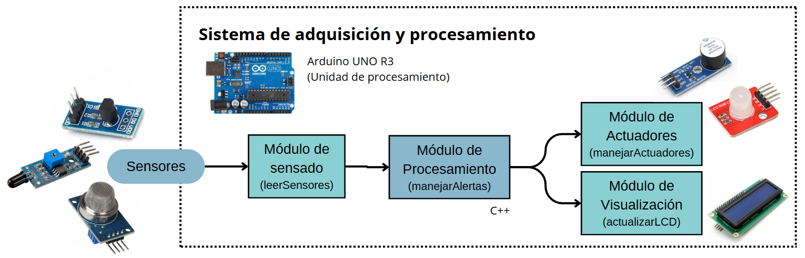
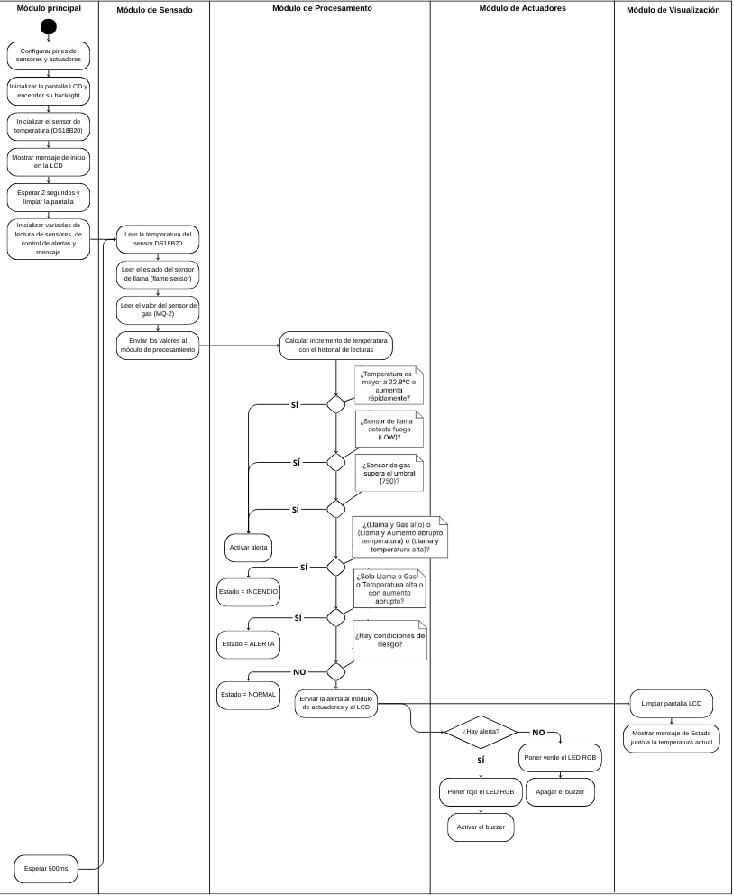

# Sistema IoT para Detección de Incendios en los Cerros Orientales de Bogotá - Challenge 1

## Información del Proyecto
- **Universidad:** Universidad de La Sabana  
- **Facultad:** Facultad de Ingeniería  
- **Materia:** Internet de las Cosas  
- **Profesor:** Juan Manuel Aranda López King  

## Integrantes del Proyecto
| Nombre | Correo Electrónico |
|--------|-------------------|
| Valentina Alejandra López Romero | valentinalopro@unisabana.edu.co |
| Ana Lucía Quintero Vargas | anaquiva@unisabana.edu.co |
| Mariana Valle Moreno | marianavamo@unisabana.edu.co |

## Estructura de la Documentación
- [1. Introducción](#1-introducción)
- [2. Motivación y Justificación](#2-motivación-y-justificación)
- [3. Solución Propuesta](#3-solución-propuesta)
- [4. Configuración Experimental, Resultados y Análisis](#4-configuración-experimental-resultados-y-análisis)
- [5. Autoevaluación del Protocolo de Pruebas](#5-autoevaluación-del-protocolo-de-pruebas)
- [6. Conclusiones, Retos y Mejoras Futuras](#6-conclusiones-retos-y-mejoras-futuras)
- [7. Referencias](#7-referencias)
- [8. Anexos](#8-anexos)

---

## 1. Introducción
<p align="justify">
Los cerros orientales de Bogotá son fundamentales para la regulación climática y la conservación de la biodiversidad. Su presencia como barrera y protector natural constituye un regulador del clima, del cual depende en buena medida la disponibilidad de agua para la capital y municipios aledaños [1]. Además, son esenciales en la producción de oxígeno en una sabana donde la pérdida de vegetación es creciente, lo que los hace aún más vulnerables a incendios forestales agravados por sequías prolongadas, altas temperaturas y la acumulación de material seco, junto con actividades humanas como fogatas, quemas agrícolas y expansión urbana descontrolada [2]. Un aumento repentino de temperatura, junto con la detección de llamas y gases como CO y CO₂, son indicadores clave de incendios. Implementar una solución basada en Internet de las Cosas que analice estos datos permitirá un monitoreo continuo y alertas tempranas, reduciendo la propagación del fuego y sus impactos negativos.
</p>

---

## 2. Motivación y Justificación
<p align="justify">
Actualmente, la detección de incendios en los cerros orientales de Bogotá depende de vigilancia manual o reportes ciudadanos, lo que retrasa la respuesta de las autoridades y agrava los daños ambientales y sociales. La implementación de un sistema basado en Internet de las Cosas permite el monitoreo continuo y la activación inmediata de alarmas visuales y sonoras, facilitando una intervención más rápida y eficiente ante posibles incendios forestales.  
</p>
<p align="justify">
Este proyecto integra un DS18B20, un sensor de llama y un MQ-2, los cuales detectan variaciones en temperatura, presencia de fuego y concentración de gases inflamables. La información recopilada es procesada por un Arduino Uno R3, que gestiona la activación de alertas mediante actuadores como un zumbador activo, un LED RGB y un módulo LCD I2C para notificaciones en tiempo real. Gracias a su diseño compacto y autónomo, el sistema puede operar en entornos remotos sin depender de redes externas, lo que lo hace ideal para zonas con infraestructura de comunicación limitada. Esta solución busca optimizar los tiempos de respuesta, reducir el impacto ambiental de los incendios y fortalecer las estrategias de prevención.
</p>

---

## 3. Solución Propuesta

### Restricciones de Diseño Identificadas

Al desarrollar el sistema IoT para detectar incendios en los cerros orientales de Bogotá, se identificaron varias restricciones que afectan su diseño e implementación:

#### 1. Técnicas
- Se usa un **Arduino Uno R3**, que tiene recursos limitados de procesamiento y memoria, por lo que solo se pueden conectar ciertos sensores y usar algoritmos simples.
- Los sensores **temperatura, MQ-2 (gases) y sensor de llama** requieren calibración para evitar falsas alarmas.
- La alimentación del sistema debe ser autónoma para funcionar sin conexión a la red eléctrica.

#### 2. Económicas
- Se busca minimizar costos, eligiendo sensores asequibles y fáciles de conseguir.
- No se usan tecnologías más avanzadas,debido a su alto precio.

#### 3. Regulatorias
- Se debe cumplir con normativas ambientales y de seguridad eléctrica para su instalación en áreas protegidas.
- Cualquier intervención en los cerros debe ajustarse a regulaciones locales.

#### 4. Espaciales
- El sistema debe ser compacto y resistente a condiciones climáticas adversas (lluvia, humedad y polvo).
- Los sensores deben ubicarse en puntos estratégicos para maximizar su efectividad sin afectar el ecosistema.

#### 5. Escalabilidad
- Aunque es un prototipo, debe permitir mejoras o expansión en el futuro.
- Se deja la opción de agregar más sensores o conectividad remota en versiones posteriores.

#### 6. Temporales
- El sistema debe operar en **tiempo real** para detectar incendios lo más rápido posible.
- Debe ser **autónomo y de bajo mantenimiento**, funcionando sin intervención constante.


### Arquitectura propuesta

A continuación, se presenta un diagrama de bloques que ilustra los elementos de hardware y software que conforman la solución IoT desarrollada.

*Figura 1: Arquitectura IoT propuesta de la solución.*

El sistema está basado en un **Arduino UNO R3**, el cual monitorea continuamente el entorno mediante un **sensor de temperatura (DS18B20)**, un **sensor de gas (MQ-2)** y un **sensor de llama**. Las señales generadas por estos dispositivos son procesadas en el **módulo de sensado**, que recopila la información y la envía al **módulo de procesamiento** para analizar si las condiciones detectadas son seguras o representan un riesgo. En caso de alerta, el **módulo de actuadores** activa un **LED RGB** para indicar el estado y emite una señal sonora a través del **buzzer**, mientras que el **módulo de visualización** muestra en la pantalla **LCD I2C**** la temperatura actual y el estado del lugar. De igual forma, toda la lógica de control está programada en C++ sobre Arduino, lo que permite que el sistema opere de manera autónoma y responda de forma inmediata a cualquier cambio en el ambiente.


### Desarrollo Teórico Modular: Criterios de Diseño Establecidos

Para que el sistema sea eficiente y funcional, se definieron los siguientes criterios de diseño:

#### 1. Fiabilidad y Precisión
- Se seleccionaron sensores que brindan datos confiables sobre temperatura, gases y llamas.
- Se implementarán límites y filtros dentro del código para reducir errores y evitar falsas alarmas.

#### 2. Autonomía y Mantenimiento Reducido
- El sistema es **autosuficiente**, sin necesidad de conexión a redes externas.
- Su diseño es resistente a la intemperie, minimizando la necesidad de mantenimiento.

#### 3. Interfaz de Usuario Intuitiva
- Se usa una **pantalla LCD** para mostrar datos en tiempo real.
- Se incluyen **alarmas sonoras (zumbador) y visuales (LED RGB)** para alertar sobre incendios.

#### 4. Escalabilidad y Modularidad
- Se diseñó de forma **modular**, lo que facilita agregar nuevos sensores o funciones en el futuro.
- En futuras versiones, se podría incluir conectividad remota para alertar de manera automática.

  
### Estándares de Ingeniería Aplicados

Para asegurar que el sistema sea seguro, eficiente y de calidad, se han seguido los siguientes estándares de ingeniería:

#### 1. Sensores y Electrónica
- **IEEE 1451**: Establece reglas para la interoperabilidad de sensores en sistemas IoT.
- **ISO 9001**: Asegura un proceso estructurado y de calidad en el desarrollo del sistema.


#### 2. Programación y Software
- **Arduino Coding Standards**: Buenas prácticas para escribir código limpio y eficiente en Arduino Ide.


### Diagrama UML

La siguiente figura ilustra el diagrama de actividades de la solución propuesta, donde por motivos de tamaño también se incluye un link para poder visualizarlo de mejor forma.

*Figura 2: Diagrama UML de actividades de la solución propuesta.*


---

## 4. Configuración Experimental, Resultados y Análisis

---

## 5. Autoevaluación del Protocolo de Pruebas
<p align="justify">
El sistema de detección de incendios fue sometido a una serie de pruebas en condiciones controladas para evaluar su precisión y capacidad de respuesta ante variaciones en temperatura, presencia de gases y detección de llamas. Estas pruebas permitieron identificar fortalezas y limitaciones en el desempeño del sistema, lo que facilitó la implementación de ajustes para mejorar su fiabilidad y reducir posibles falsas alarmas.
</p>
<p align="justify">
Las pruebas de detección de llama consistieron en colocar un mechero a diferentes distancias del sensor de llama para determinar su rango efectivo. Se observó que la sensibilidad del sensor disminuye a medida que la distancia aumenta y que su precisión puede verse afectada por la intensidad de la luz ambiental. En cuanto al sensor de gas (MQ-2), se evidenció que la detección era más eficiente cuando el mechero se activaba sin generar llama, ya que la combustión altera la concentración de gas en el ambiente, dificultando alcanzar los valores esperados para la activación de la alerta. Finalmente, el sensor de temperatura (DS18B20) mostró un incremento gradual en los valores detectados. Sin embargo, debido a la estabilidad del entorno de prueba, los cambios tardaban en alcanzar valores críticos, lo que podría impactar la detección temprana en un escenario real.
</p>

### Mejoras Identificadas en el Proceso de Pruebas

- **Calibración de umbrales:**  
  <p align="justify">
  Durante las pruebas iniciales, los valores de detección de gas y temperatura no coincidían con los umbrales esperados. Se observó que, en algunos casos, la activación de la alerta demoraba demasiado o, por el contrario, se generaban falsas alarmas incluso sin encender el mechero. Para mitigar estos inconvenientes, se ajustaron los valores límite del sensor de gas y del sensor de temperatura, logrando una activación más precisa de las alarmas.
  </p>

- **Optimización de la pantalla LCD:**  
  <p align="justify">
  Inicialmente, la visibilidad de los valores en la pantalla LCD I2C se veía afectada por la iluminación ambiental. Para mejorar la legibilidad, se ajustó el brillo y el contraste de la pantalla, asegurando que los valores de los sensores fueran visibles en tiempo real y facilitando el monitoreo del sistema durante las pruebas.
  </p>

- **Condición dual para la alerta de incendio:**  
  <p align="justify">
  Se implementó una mejora en la lógica del sistema para que la alerta de incendio solo se active si al menos dos sensores detectan simultáneamente una condición de peligro (<strong>llama + gas</strong>, <strong>llama + temperatura alta</strong>). Además, se establecieron alertas individuales para cada sensor cuando superaban los valores críticos, proporcionando información clara a los usuarios a través de la pantalla LCD.
  </p>

- **Integración de un LED RGB para estado del sistema:**  
  <p align="justify">
  Se incorporó un LED RGB que permanece encendido en verde mientras el sistema detecta condiciones normales y cambia a rojo en caso de alerta de incendio, proporcionando una señal visual inmediata sobre el estado del sistema.
  </p>

### Comparación de Desempeño con Expectativas Iniciales
<p align="justify">
El desempeño del sistema se evaluó con base en los objetivos establecidos en la fase de diseño, asegurando que la detección de incendios y la activación de alertas ocurrieran dentro de un tiempo razonable y con la precisión esperada.
</p>

| **Parámetro**             | **Expectativa Inicial**                                     | **Resultado de Pruebas**  |
|---------------------------|------------------------------------------------------------|---------------------------|
| **Detección de llama**    | Alta precisión en distintas condiciones de iluminación    | Funcional en baja iluminación, con limitaciones en entornos muy brillantes |
| **Detección de gas**      | Sensibilidad suficiente para detectar variaciones críticas | Eficiente, pero con mejor rendimiento cuando el mechero se activa sin llama |
| **Detección de temperatura** | Identificación confiable de incrementos anómalos | Responde correctamente, pero con cambios graduales que pueden retrasar la alerta |
| **Activación de alertas** | Generación de alarmas en situaciones de riesgo real       | Mejorada con la implementación de alertas combinadas para incendios |
| **Fiabilidad del sistema** | Capacidad para reducir falsas alarmas                     | Ajustada con la calibración de umbrales y optimización de la lógica de detección |

<p align="justify">
Si bien el sistema mostró un desempeño adecuado en la mayoría de los casos, se identificaron algunas áreas de mejora. En particular, la detección de temperatura presentó un comportamiento más gradual, lo que podría impactar la rapidez con la que se identifica un incendio en desarrollo. Además, la detección de llama mostró sensibilidad a condiciones de iluminación intensa, lo que puede afectar su rendimiento en escenarios más dinámicos.
</p>
<p align="justify">
Para mejorar la fiabilidad y precisión del sistema, se recomienda la implementación de un algoritmo de filtrado de datos que ajuste los umbrales de detección de manera dinámica y optimice la activación de alertas en función de las condiciones ambientales en tiempo real.
</p>

---

## 6. Conclusiones, Retos y Mejoras Futuras

---

## 7. Referencias

[1] N. Bustamante, “La importancia de proteger a los cerros orientales de Bogotá,” *El Tiempo*, 26 de febrero de 2019. [Online]. Disponible en: [https://www.eltiempo.com/vida/ciencia/la-importancia-de-proteger-a-los-cerros-orientales-de-bogota-279294](https://www.eltiempo.com/vida/ciencia/la-importancia-de-proteger-a-los-cerros-orientales-de-bogota-279294). [Accedido: 12-feb-2025].  

[2] El Espectador, “Incendio forestal en los cerros orientales de Bogotá: ¿Por qué se producen?,” *El Espectador*, 31 de enero de 2023. [Online]. Disponible en: [https://www.elespectador.com/cromos/famosos/incendio-forestal-en-los-cerros-orientales-de-bogota-por-que-se-producen/](https://www.elespectador.com/cromos/famosos/incendio-forestal-en-los-cerros-orientales-de-bogota-por-que-se-producen/). [Accedido: 12-feb-2025].  

---

## 8. Anexos

```

