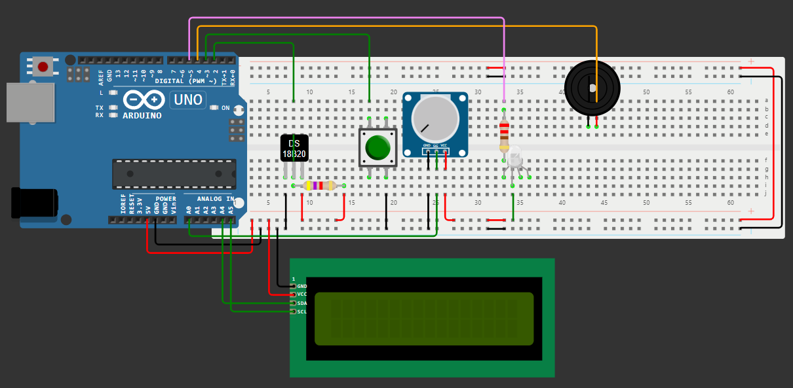

# Sistema IoT para Detección de Incendios en los Cerros Orientales de Bogotá - Challenge 1

## Información del Proyecto
- **Universidad:** Universidad de La Sabana  
- **Facultad:** Facultad de Ingeniería  
- **Materia:** Internet de las Cosas  
- **Profesor:** Juan Manuel Aranda López King  

## Integrantes del Proyecto
| Nombre | Correo Electrónico |
|--------|-------------------|
| Valentina Alejandra López Romero | valentinalopro@unisabana.edu.co |
| Ana Lucía Quintero Vargas | anaquiva@unisabana.edu.co |
| Mariana Valle Moreno | marianavamo@unisabana.edu.co |

## Estructura de la Documentación
- [1. Introducción](#1-introducción)
- [2. Motivación y Justificación](#2-motivación-y-justificación)
- [3. Solución Propuesta](#3-solución-propuesta)
- [4. Configuración Experimental, Resultados y Análisis](#4-configuración-experimental-resultados-y-análisis)
- [5. Autoevaluación del Protocolo de Pruebas](#5-autoevaluación-del-protocolo-de-pruebas)
- [6. Conclusiones, Retos y Mejoras Futuras](#6-conclusiones-retos-y-mejoras-futuras)
- [7. Referencias](#7-referencias)
- [8. Anexos](#8-anexos)

---

## 1. Introducción
<p align="justify">
Los cerros orientales de Bogotá son fundamentales para la regulación climática y la conservación de la biodiversidad. Su presencia como barrera y protector natural constituye un regulador del clima, del cual depende en buena medida la disponibilidad de agua para la capital y municipios aledaños [1]. Además, son esenciales en la producción de oxígeno en una sabana donde la pérdida de vegetación es creciente, lo que los hace aún más vulnerables a incendios forestales agravados por sequías prolongadas, altas temperaturas y la acumulación de material seco, junto con actividades humanas como fogatas, quemas agrícolas y expansión urbana descontrolada [2]. Un aumento repentino de temperatura, junto con la detección de llamas y gases como CO y CO₂, son indicadores clave de incendios. Implementar una solución basada en Internet de las Cosas que analice estos datos permitirá un monitoreo continuo y alertas tempranas, reduciendo la propagación del fuego y sus impactos negativos.
</p>

---

## 2. Motivación y Justificación
<p align="justify">
Actualmente, la detección de incendios en los cerros orientales de Bogotá depende de vigilancia manual o reportes ciudadanos, lo que retrasa la respuesta de las autoridades y agrava los daños ambientales y sociales. La implementación de un sistema basado en Internet de las Cosas permite el monitoreo continuo y la activación inmediata de alarmas visuales y sonoras, facilitando una intervención más rápida y eficiente ante posibles incendios forestales.  
</p>
<p align="justify">
Este proyecto integra un DS18B20, un sensor de llama y un MQ-2, los cuales detectan variaciones en temperatura, presencia de fuego y concentración de gases inflamables. La información recopilada es procesada por un Arduino Uno R3, que gestiona la activación de alertas mediante actuadores como un zumbador activo, un LED RGB y un módulo LCD I2C para notificaciones en tiempo real. Gracias a su diseño compacto y autónomo, el sistema puede operar en entornos remotos sin depender de redes externas, lo que lo hace ideal para zonas con infraestructura de comunicación limitada. Esta solución busca optimizar los tiempos de respuesta, reducir el impacto ambiental de los incendios y fortalecer las estrategias de prevención.
</p>

---

## 3. Solución Propuesta

### Restricciones de Diseño Identificadas

Al desarrollar el sistema IoT para detectar incendios en los cerros orientales de Bogotá, se identificaron varias restricciones que afectan su diseño e implementación:

#### 1. Técnicas
- Se usa un **Arduino Uno R3**, que tiene recursos limitados de procesamiento y memoria, por lo que solo se pueden conectar ciertos sensores y usar algoritmos simples.
- Los sensores **temperatura, MQ-2 (gases) y sensor de llama** requieren calibración para evitar falsas alarmas.
- La alimentación del sistema debe ser autónoma para funcionar sin conexión a la red eléctrica.

#### 2. Económicas
- Se busca minimizar costos, eligiendo sensores asequibles y fáciles de conseguir.
- No se usan tecnologías más avanzadas,debido a su alto precio.

#### 3. Regulatorias
- Se debe cumplir con normativas ambientales y de seguridad eléctrica para su instalación en áreas protegidas.
- Cualquier intervención en los cerros debe ajustarse a regulaciones locales.

#### 4. Espaciales
- El sistema debe ser compacto y resistente a condiciones climáticas adversas (lluvia, humedad y polvo).
- Los sensores deben ubicarse en puntos estratégicos para maximizar su efectividad sin afectar el ecosistema.

#### 5. Escalabilidad
- Aunque es un prototipo, debe permitir mejoras o expansión en el futuro.
- Se deja la opción de agregar más sensores o conectividad remota en versiones posteriores.

#### 6. Temporales
- El sistema debe operar en **tiempo real** para detectar incendios lo más rápido posible.
- Debe ser **autónomo y de bajo mantenimiento**, funcionando sin intervención constante.


### Arquitectura Propuesta

A continuación, se presenta un Diagrama de Bloques que ilustra los elementos de hardware y software que conforman la solución IoT desarrollada.


*Figura 1: Arquitectura IoT propuesta de la solución.*

El sistema está basado en un **Arduino UNO R3**, el cual monitorea continuamente el entorno mediante un **sensor de temperatura (DS18B20)**, un **sensor de gas (MQ-2)** y un **sensor de llama**. Las señales generadas por estos dispositivos son procesadas en el **módulo de sensado**, que recopila la información y la envía al **módulo de procesamiento** para analizar si las condiciones detectadas son seguras o representan un riesgo. En caso de alerta, el **módulo de actuadores** activa un **LED RGB** para indicar el estado y emite una señal sonora a través del **buzzer**, mientras que el **módulo de visualización** muestra en la pantalla **LCD I2C**** la temperatura actual y el estado del lugar. De igual forma, toda la lógica de control está programada en C++ sobre Arduino, lo que permite que el sistema opere de manera autónoma y responda de forma inmediata a cualquier cambio en el ambiente.


### Desarrollo Teórico Modular: Criterios de Diseño Establecidos

Para que el sistema sea eficiente y funcional, se definieron los siguientes criterios de diseño:

#### 1. Fiabilidad y Precisión
- Se seleccionaron sensores que brindan datos confiables sobre temperatura, gases y llamas.
- Se implementarán límites y filtros dentro del código para reducir errores y evitar falsas alarmas.

#### 2. Autonomía y Mantenimiento Reducido
- El sistema es **autosuficiente**, sin necesidad de conexión a redes externas.
- Su diseño es resistente a la intemperie, minimizando la necesidad de mantenimiento.

#### 3. Interfaz de Usuario Intuitiva
- Se usa una **pantalla LCD** para mostrar datos en tiempo real.
- Se incluyen **alarmas sonoras (zumbador) y visuales (LED RGB)** para alertar sobre incendios.

#### 4. Escalabilidad y Modularidad
- Se diseñó de forma **modular**, lo que facilita agregar nuevos sensores o funciones en el futuro.
- En futuras versiones, se podría incluir conectividad remota para alertar de manera automática.


### Diagrama UML

La siguiente figura ilustra el Diagrama de Actividad UML de la solución propuesta, en donde para visualizarlo de mejor forma se incluye un link adicional.


*Figura 2: Diagrama UML de actividades de la solución propuesta.*

- ***Link para mejor visualización del diagrama:*** https://www.canva.com/design/DAGfaAzHR50/iTku3yr3iAYa7nXp0wMO8w/view?utm_content=DAGfaAzHR50&utm_campaign=designshare&utm_medium=link2&utm_source=uniquelinks&utlId=h7452e3d912

Este diagrama de la solución propuesta representa el flujo de ejecución del sistema, abarcando desde la inicialización hasta la activación de los actuadores y la visualización de datos en la pantalla LCD. Para organizar mejor este proceso, el sistema se divide en cinco módulos: módulo principal, módulo de sensado, módulo de procesamiento, módulo de actuadores y módulo de visualización, cada uno desempeñando una función específica dentro del ciclo de monitoreo.

El proceso comienza en el módulo principal, donde se configuran los pines de entrada y salida, se inicializa la pantalla LCD y el sensor de temperatura, y se establecen las variables de estado. A continuación, en el módulo de sensado, el sistema recoge información de los sensores de temperatura (DS18B20), gas (MQ-2) y llama, asegurando una medición precisa del entorno. Luego, estos datos se transfieren al módulo de procesamiento, el cual los analiza para determinar si las condiciones son seguras o si es necesario activar una alerta. Para ello, se aplican reglas de decisión basadas en umbrales predefinidos, clasificando la situación en tres posibles estados: normal, alerta (indicando en pantalla el problema detectado) o incendio.

Si se detecta una alerta, el sistema activa el módulo de actuadores, encendiendo el LED RGB (en rojo o verde, según el nivel de riesgo) y activando o desactivando el buzzer para generar una advertencia sonora. Al mismo tiempo, el módulo de visualización actualiza la pantalla LCD, mostrando la temperatura actual junto con un mensaje que indica el estado del sistema. Finalmente, una vez completadas todas estas acciones, el sistema espera 500 ms antes de repetir el ciclo, permitiendo un monitoreo constante y en tiempo real.


### Esquemático de Hardware

En seguida, se muestra el diagrama que representa el Esquemático de Hardware de la solución planteada.

*Figura 3: Esquemático de hardware de la solución propuesta.*

En la simulación realizada en Wokwi, se utilizó un sensor de temperatura real; sin embargo, debido a la falta de disponibilidad de los sensores de gas y llama en la plataforma, se recurrió a la utilización de un potenciómetro para simular el sensor de gas y un botón para simular el sensor de llama. El potenciómetro se conectó a un pin analógico, lo que permitió ajustar manualmente el valor que representaba la concentración de gas. Por su parte, el botón actuó como un sensor de llama, generando una señal digital al presionarlo, lo que indicaba la presencia de una llama.

El código fue diseñado para manejar tanto el sensor de temperatura como los componentes simulados, activando las alertas correspondientes según las lecturas obtenidas de cada uno. Posteriormente, al trasladar el proyecto a la implementación física, se montaron los tres sensores reales: el sensor de temperatura, el sensor de gas y el sensor de llama. Los sensores reales fueron conectados a los mismos pines definidos previamente en el código de la simulación. En este sentido, los cambios realizados en el código fueron mínimos, ya que solo se adaptaron las lecturas de los sensores físicos. De este modo, el comportamiento del sistema tanto en la simulación como en la implementación real se mantuvo consistente, lo que confirmó que el diseño inicial en la simulación era adecuado para la ejecución en hardware físico.


### Estándares de Ingeniería Aplicados

Para garantizar que el sistema desarrollado sea seguro, eficiente y cumpla con principios de calidad, se han aplicado diversos estándares de ingeniería:

#### 1. Sensores y Electrónica
- **IEEE 1451**: Establece reglas para la interoperabilidad de sensores en sistemas IoT.
- **ISO 9001**: Establece un marco de gestión de calidad, garantizando un proceso estructurado en el desarrollo del sistema y la selección de componentes electrónicos confiables.

#### 2. Programación y Software
- **Arduino Coding Standards**: Conjunto de buenas prácticas para escribir código limpio y eficiente en Arduino IDE.

#### 3. Modelado y Documentación
- **UML (ISO/IEC 19501)**: – Lenguaje estandarizado para la representación visual de sistemas software y hardware.

---

## 4. Configuración Experimental, Resultados y Análisis
<p align="justify">
Para comprobar el correcto funcionamiento del sistema, se llevó a cabo una prueba experimental en el laboratorio, donde ya se contaba con todos los elementos necesarios para la validación del prototipo. A diferencia del esquemático de hardware, en esta etapa se integraron todos los sensores y actuadores, incluyendo el sensor de temperatura (DS18B20), el sensor de gas (MQ-2), el sensor de llama, el LED RGB, el buzzer y la pantalla LCD I2C. El circuito fue montado en una protoboard, utilizando jumpers, una resistencia de 4,7 kΩ para el sensor de temperatura y una resistencia de 220 Ω para el LED RGB. Posteriormente, el Arduino UNO R3 se conectó a la computadora mediante USB, permitiendo la carga y ejecución del código en Arduino IDE. Con el hardware ensamblado, el sistema comenzó a operar en un ambiente controlado, donde la temperatura ambiente se mantenía entre 21 y 22 °C, asegurando condiciones iniciales estables antes de realizar las pruebas.

Para evaluar la respuesta del sistema ante una posible situación de incendio, se utilizó un encendedor a gas como herramienta de prueba para los tres sensores involucrados. Primero, se dejó escapar gas sin encender la llama para que el sensor de gas (MQ-2) detectara el aumento en la concentración de partículas inflamables. Luego, se encendió el encendedor y se acercó la llama tanto al sensor de llama como al sensor de temperatura (DS18B20). Esto permitió medir la capacidad del sistema para registrar el incremento de temperatura y la detección directa de fuego. La prueba se repitió varias veces, asegurando que el sistema respondiera de manera consistente ante los estímulos aplicados.

Durante la ejecución, el código—el cual se encuentra en los anexos—operó en un ciclo continuo, iniciando con la lectura de sensores, donde se capturaban datos de temperatura, estado de la llama y concentración de gas. Posteriormente, en la función de manejo de alertas, estos valores se comparaban con los umbrales predefinidos para determinar si la situación correspondía a un estado normal, una alerta o una situación de incendio. Las condiciones evaluadas incluían un cambio brusco de temperatura o un valor superior a 22.8 °C, la detección de una llama y una concentración de gas superior a 750 (este valor se estableció tras realizar múltiples pruebas en las que se compararon las mediciones del sensor al detectar la presencia de la llama, identificando que a partir de dicho umbral la detección era consistente).

De acuerdo con lo anterior, si se cumplía al menos una de estas condiciones, el sistema entraba en estado de alerta. En caso de que la detección de llama coincidiera con niveles elevados de gas o temperatura, la alerta se priorizaba como incendio, generando una respuesta casi inmediata. Tras la clasificación del evento, el módulo de actuadores reaccionaba en consecuencia, donde en estado normal, el LED RGB permanecía en verde y el buzzer se mantenía apagado. En cambio, al detectar una alerta o incendio, el LED cambiaba a rojo y el buzzer se activaba, proporcionando una señal visual y sonora que advertía sobre el peligro detectado.

Finalmente, los resultados experimentales confirmaron que el sistema operó conforme a lo esperado, validando la precisión de los sensores y la correcta ejecución del código. En cada repetición de la prueba, los sensores registraron adecuadamente los cambios en el entorno, las alertas se activaron según los parámetros programados y los actuadores reflejaron el estado del sistema en tiempo real. Además, la lógica implementada en el código permitió una priorización eficiente de eventos críticos, asegurando que situaciones de mayor riesgo fueran alertadas a tiempo. Asimismo, se verificó que los tiempos de respuesta fueron óptimos, cumpliendo con la duración establecida en el código para la activación de cada alerta.

---

## 5. Autoevaluación del Protocolo de Pruebas
<p align="justify">
El sistema de detección de incendios fue sometido a una serie de pruebas en condiciones controladas para evaluar su precisión y capacidad de respuesta ante variaciones en temperatura, presencia de gases y detección de llamas. Estas pruebas permitieron identificar fortalezas y limitaciones en el desempeño del sistema, lo que facilitó la implementación de ajustes para mejorar su fiabilidad y reducir posibles falsas alarmas.
</p>
<p align="justify">
Las pruebas de detección de llama consistieron en colocar un mechero a diferentes distancias del sensor de llama para determinar su rango efectivo. Se observó que la sensibilidad del sensor disminuye a medida que la distancia aumenta y que su precisión puede verse afectada por la intensidad de la luz ambiental. En cuanto al sensor de gas (MQ-2), se evidenció que la detección era más eficiente cuando el mechero se activaba sin generar llama, ya que la combustión altera la concentración de gas en el ambiente, dificultando alcanzar los valores esperados para la activación de la alerta. Finalmente, el sensor de temperatura (DS18B20) mostró un incremento gradual en los valores detectados. Sin embargo, debido a la estabilidad del entorno de prueba, los cambios tardaban en alcanzar valores críticos, lo que podría impactar la detección temprana en un escenario real.
</p>

### Mejoras Identificadas en el Proceso de Pruebas

- **Calibración de umbrales:**  
  <p align="justify">
  Durante las pruebas iniciales, los valores de detección de gas y temperatura no coincidían con los umbrales esperados. Se observó que, en algunos casos, la activación de la alerta demoraba demasiado o, por el contrario, se generaban falsas alarmas incluso sin encender el mechero. Para mitigar estos inconvenientes, se ajustaron los valores límite del sensor de gas y del sensor de temperatura, logrando una activación más precisa de las alarmas.
  </p>

- **Optimización de la pantalla LCD:**  
  <p align="justify">
  Inicialmente, la visibilidad de los valores en la pantalla LCD I2C se veía afectada por la iluminación ambiental. Para mejorar la legibilidad, se ajustó el brillo y el contraste de la pantalla, asegurando que los valores de los sensores fueran visibles en tiempo real y facilitando el monitoreo del sistema durante las pruebas.
  </p>

- **Condición dual para la alerta de incendio:**  
  <p align="justify">
  Se implementó una mejora en la lógica del sistema para que la alerta de incendio solo se active si al menos dos sensores detectan simultáneamente una condición de peligro (<strong>llama + gas</strong>, <strong>llama + temperatura alta</strong>). Además, se establecieron alertas individuales para cada sensor cuando superaban los valores críticos, proporcionando información clara a los usuarios a través de la pantalla LCD.
  </p>

- **Integración de un LED RGB para estado del sistema:**  
  <p align="justify">
  Se incorporó un LED RGB que permanece encendido en verde mientras el sistema detecta condiciones normales y cambia a rojo en caso de alerta de incendio, proporcionando una señal visual inmediata sobre el estado del sistema.
  </p>

### Comparación de Desempeño con Expectativas Iniciales
<p align="justify">
El desempeño del sistema se evaluó con base en los objetivos establecidos en la fase de diseño, asegurando que la detección de incendios y la activación de alertas ocurrieran dentro de un tiempo razonable y con la precisión esperada.
</p>

| **Parámetro**             | **Expectativa Inicial**                                     | **Resultado de Pruebas**  |
|---------------------------|------------------------------------------------------------|---------------------------|
| **Detección de llama**    | Alta precisión en distintas condiciones de iluminación    | Funcional en baja iluminación, con limitaciones en entornos muy brillantes |
| **Detección de gas**      | Sensibilidad suficiente para detectar variaciones críticas | Eficiente, pero con mejor rendimiento cuando el mechero se activa sin llama |
| **Detección de temperatura** | Identificación confiable de incrementos anómalos | Responde correctamente, pero con cambios graduales que pueden retrasar la alerta |
| **Activación de alertas** | Generación de alarmas en situaciones de riesgo real       | Mejorada con la implementación de alertas combinadas para incendios |
| **Fiabilidad del sistema** | Capacidad para reducir falsas alarmas                     | Ajustada con la calibración de umbrales y optimización de la lógica de detección |

<p align="justify">
Si bien el sistema mostró un desempeño adecuado en la mayoría de los casos, se identificaron algunas áreas de mejora. En particular, la detección de temperatura presentó un comportamiento más gradual, lo que podría impactar la rapidez con la que se identifica un incendio en desarrollo. Además, la detección de llama mostró sensibilidad a condiciones de iluminación intensa, lo que puede afectar su rendimiento en escenarios más dinámicos.
</p>
<p align="justify">
Para mejorar la fiabilidad y precisión del sistema, se recomienda la implementación de un algoritmo de filtrado de datos que ajuste los umbrales de detección de manera dinámica y optimice la activación de alertas en función de las condiciones ambientales en tiempo real.
</p>

---

## 6. Conclusiones, Retos y Mejoras Futuras


### Conclusiones
El desarrollo de un sistema IoT para la detección de incendios en los cerros orientales de Bogotá demostró la viabilidad de implementar soluciones autónomas y compactas para la prevención de desastres naturales. A lo largo del proceso, se logró integrar sensores de temperatura (DS18B20), detección de llamas y gases (MQ-2) con actuadores como un buzzer, un LED RGB y una pantalla LCD I2C para notificaciones en tiempo real. La simulación en Wokwi permitió evaluar el comportamiento del sistema sin necesidad de hardware físico, facilitando la validación de su funcionalidad antes de una implementación real.

Uno de los principales logros del proyecto fue la correcta integración de los sensores y actuadores, asegurando una respuesta eficiente ante la detección de condiciones de riesgo. Además, el diseño del sistema priorizó la autonomía, eliminando la dependencia de redes externas para garantizar su operatividad en entornos remotos.

### Retos Presentados Durante el Desarrollo del Proyecto
Durante el desarrollo del proyecto, se enfrentaron varios retos técnicos y de diseño, entre los cuales se destacan:
- **Calibración de sensores:** Asegurar la precisión de los sensores, especialmente el MQ-2, que puede verse afectado por factores ambientales.
- **Integración en Arduino IDE:** La programación y configuración de los sensores en el entorno Arduino IDE presentó dificultades, especialmente en la correcta lectura de valores y la sincronización con los actuadores. Fue necesario probar diferentes bibliotecas y ajustar parámetros para garantizar lecturas estables.
- **Optimización del código:** Se debió optimizar el código para minimizar latencias en la detección de eventos y evitar falsas alarmas, asegurando un desempeño eficiente en un entorno con recursos limitados como el Arduino Uno R3.
- **Simulación en Wokwi:** La plataforma presentó limitaciones en la emulación precisa del comportamiento de algunos sensores, lo que requirió ajustes en el código y pruebas adicionales.

### Trabajo Futuro
Para mejorar y expandir el sistema, se identifican varias áreas de trabajo futuro:
- **Incorporación de conectividad inalámbrica:** Integrar módulos para enviar alertas a estaciones remotas o a brigadas de emergencia.
- **Uso de inteligencia artificial:** Aplicar algoritmos de machine learning para mejorar la precisión en la detección de incendios y reducir falsas alarmas.
- **Implementación de un prototipo físico:** Construcción y prueba en campo de una versión funcional del sistema para validar su desempeño en condiciones reales.
- **Ampliación del sistema de monitoreo:** Incorporar sensores adicionales, como de humedad y velocidad del viento, para mejorar la detección de riesgos ambientales.

En conclusión, el proyecto representa un primer paso en la creación de soluciones tecnológicas para la prevención de incendios forestales. La implementación futura de mejoras permitirá fortalecer su efectividad y aplicabilidad en escenarios reales, contribuyendo a la protección del ecosistema de los cerros orientales de Bogotá.


---

## 7. Referencias

[1] N. Bustamante, “La importancia de proteger a los cerros orientales de Bogotá,” *El Tiempo*, 26 de febrero de 2019. [Online]. Disponible en: [https://www.eltiempo.com/vida/ciencia/la-importancia-de-proteger-a-los-cerros-orientales-de-bogota-279294](https://www.eltiempo.com/vida/ciencia/la-importancia-de-proteger-a-los-cerros-orientales-de-bogota-279294). [Accedido: 12-feb-2025].  

[2] El Espectador, “Incendio forestal en los cerros orientales de Bogotá: ¿Por qué se producen?,” *El Espectador*, 31 de enero de 2023. [Online]. Disponible en: [https://www.elespectador.com/cromos/famosos/incendio-forestal-en-los-cerros-orientales-de-bogota-por-que-se-producen/](https://www.elespectador.com/cromos/famosos/incendio-forestal-en-los-cerros-orientales-de-bogota-por-que-se-producen/). [Accedido: 12-feb-2025].  

---

## 8. Anexos

#### Código fuente

#include <Wire.h>
#include <LiquidCrystal_I2C.h>
#include <OneWire.h>
#include <DallasTemperature.h>

// ========================== DEFINICIÓN DE PINES ==========================

// Pines de los sensores
#define TEMP_SENSOR_PIN 2   // Pin digital para el sensor de temperatura DS18B20
#define FLAME_SENSOR_PIN 3  // Pin digital para el sensor de llama
#define GAS_SENSOR_PIN A0   // Pin analógico para el sensor de gas MQ-2

// Pines de los actuadores
#define BUZZER_SENSOR_PIN 4 // Pin digital para el zumbador
#define LED_RED_PIN 5       // Pin digital para componente rojo del LED RGB
#define LED_GREEN_PIN 6     // Pin digital para componente verde del LED RGB

// ========================== PARÁMETROS DEL SISTEMA ==========================

#define MAX_TEMPS 5  // Número de muestras de temperatura almacenadas

// Configuración de la pantalla LCD I2C (16x2)
LiquidCrystal_I2C lcd(0x27, 16, 2);

// Configuración del sensor de temperatura
OneWire oneWire(TEMP_SENSOR_PIN);
DallasTemperature sensors(&oneWire);

// Umbrales de alerta
const float TEMP_LIMITE = 22.8;               // Temperatura máxima permitida antes de alerta
const float TEMP_AUMENTO_RAPIDO = 0.5;        // Incremento rápido de temperatura en °C 
const int GAS_LIMITE = 750;                   // Límite de concentración de gas

// Tiempos de duración de alertas
const unsigned long DURACION_ALERTA = 3000;   // Duración de alerta estándar (ms)
const unsigned long DURACION_INCENDIO = 8000; // Duración de alerta por incendio (ms

// Variables de almacenamiento de temperatura
float temperaturas[MAX_TEMPS] = {20.0, 20.0, 20.0, 20.0, 20.0};  // Inicializa con 20°C
int indice = 0;                                                  // Índice de la próxima lectura a almacenar

// Variables de tiempo para alertas
unsigned long tiempoAlerta = 0;                // Guarda el tiempo de inicio de la alerta
unsigned long tiempoIncendio = 0;              // Guarda el tiempo de inicio de la alerta de incendio

String mensaje = "Estado Normal";              // Inicializa mensaje de alerta del LCD con estado normal

// ========================== CONFIGURACIÓN INICIAL ==========================

void setup() {
  // Configuración de pines de salida
  pinMode(BUZZER_SENSOR_PIN, OUTPUT);
  pinMode(LED_RED_PIN, OUTPUT);
  pinMode(LED_GREEN_PIN, OUTPUT);
  pinMode(FLAME_SENSOR_PIN, INPUT);

  // Inicialización del LCD y sensores
  lcd.begin(16, 2);
  lcd.backlight();
  sensors.begin();

   // Mensaje de inicio en LCD
  lcd.setCursor(0, 0);
  lcd.print("Sistema Alerta");
  lcd.setCursor(0, 1);
  lcd.print("Iniciando...");
  delay(2000);
  lcd.clear();
}

// ========================== LECTURA DE SENSORES ==========================
// Captura los valores de los sensores de temperatura, llama y gas.
void leerSensores(float &temperature, int &flameState, int &gasValue) {
  // Leer temperatura
  sensors.requestTemperatures();
  temperature = sensors.getTempCByIndex(0); 

  // Leer estado del sensor de llama (0 indica llama detectada)
  flameState = digitalRead(FLAME_SENSOR_PIN);

  // Leer nivel del sensor de gas
  gasValue = analogRead(GAS_SENSOR_PIN);
}

// ========================== MANEJO DE ALERTAS ==========================
// Analiza los valores de los sensores y determina si se activa una alerta.
void manejarAlertas(float temperature, int flameState, int gasValue, float incremento, unsigned long tiempoActual, unsigned long &tiempoAlerta, unsigned long &tiempoIncendio, bool &alerta, bool &esIncendio, String &mensaje) {
  
  // Evaluar condición de temperatura
  if (incremento >= TEMP_AUMENTO_RAPIDO || temperature >= TEMP_LIMITE) {
    alerta = true;
    tiempoAlerta = tiempoActual;
    mensaje = "ALERTA: Temp alta!";
  }

  // Evaluar condición de llama
  if (flameState == LOW) {
    alerta = true;
    tiempoAlerta = tiempoActual;
    mensaje = "ALERTA: Llama!";
  }

  // Evaluar condición de gas
  if (gasValue > GAS_LIMITE) {
    alerta = true;
    tiempoAlerta = tiempoActual;
    mensaje = "ALERTA: Gas!";
  }

  // Lógica de prioridad de alerta (si hay llama y gas o temperatura alta, se considera incendio)
  if ((flameState == LOW && gasValue > GAS_LIMITE) ||
      (flameState == LOW && incremento >= TEMP_AUMENTO_RAPIDO) ||
      (flameState == LOW && temperature >= TEMP_LIMITE)) {
    esIncendio = true;
    tiempoIncendio = tiempoActual;
    mensaje = "ALERTA: INCENDIO";
  }
}

// ========================== ACTUALIZACIÓN DEL LCD ==========================
// Muestra en la pantalla la temperatura y el estado actual.
void actualizarLCD(float temperature, String mensaje) {
  lcd.clear();
  lcd.setCursor(0, 0);
  lcd.print("Temp:");
  lcd.print(temperature);
  lcd.print("C");

  lcd.setCursor(0, 1);
  lcd.print(mensaje);
}

// ========================== CONTROL DE ACTUADORES ==========================
// Activa o desactiva el LED RGB y el buzzer según el estado del sistema.
void manejarActuadores(bool alerta) {
  if (alerta) {
    digitalWrite(LED_RED_PIN, LOW);       // Encender LED rojo
    digitalWrite(LED_GREEN_PIN, HIGH);    // Apagar LED verde
    digitalWrite(BUZZER_SENSOR_PIN, LOW); // Activar zumbador
  } else {
    digitalWrite(LED_RED_PIN, HIGH);        // Apagar LED rojo
    digitalWrite(LED_GREEN_PIN, LOW);       // Encender LED verde
    digitalWrite(BUZZER_SENSOR_PIN, HIGH);  // Apagar zumbador
  }
}

// ========================== BUCLE PRINCIPAL ==========================
// Ejecuta la lógica de monitoreo continuamente.
void loop() {
  // Variables de almacenamiento de valores de sensores
  float temperature;
  int flameState;
  int gasValue;
  unsigned long tiempoActual = millis();
  bool alerta = false;
  bool esIncendio = false;
  String mensaje = "Estado Normal";

  // Leer los valores de los sensores
  leerSensores(temperature, flameState, gasValue);

  // Calcular el cambio en temperatura
  float incremento = temperaturas[MAX_TEMPS - 1] - temperaturas[0];

  // Determinar si se debe activar una alerta
  manejarAlertas(temperature, flameState, gasValue, incremento, tiempoActual, tiempoAlerta, tiempoIncendio, alerta, esIncendio, mensaje);

  // Mantener alerta activa por el tiempo definido
  if (tiempoActual - tiempoAlerta < DURACION_ALERTA || tiempoActual - tiempoIncendio < DURACION_INCENDIO) {
    alerta = true;
    if (tiempoActual - tiempoIncendio < DURACION_INCENDIO) {
      mensaje = "ALERTA: INCENDIO";
    }
  } else {
    mensaje = "Estado Normal";
  }

  // Mostrar en LCD el estado actual
  actualizarLCD(temperature, mensaje);

  // Controlar los actuadores (LED y buzzer)
  manejarActuadores(alerta);

  delay(500); // Esperar antes de la siguiente iteración
}

```

